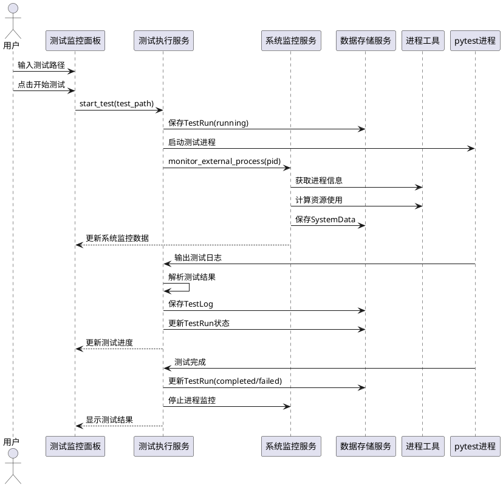
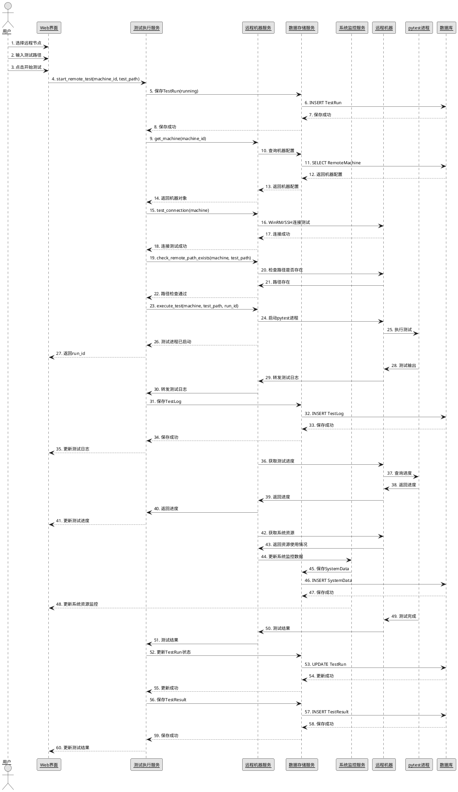
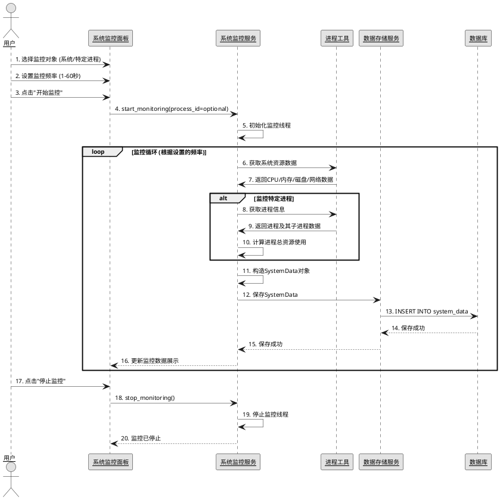
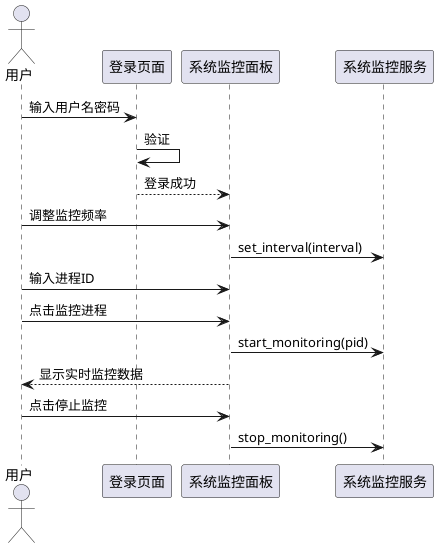

# 远程测试监控系统框架设计

## 项目结构

```
remote_test_monitor/
├── app/
│   ├── __init__.py
│   ├── main.py              # NiceGUI 主应用入口
│   ├── authentication.py    # 安全认证模块
│   ├── dashboards/          # 仪表板组件
│   │   ├── __init__.py
│   │   ├── system_monitor.py  # 系统监控面板
│   │   └── test_monitor.py     # 测试监控面板
│   ├── models/              # 数据模型
│   │   ├── __init__.py
│   │   ├── system_data.py     # 系统监控数据模型
│   │   └── test_data.py       # 测试数据模型
│   ├── services/            # 服务模块
│   │   ├── __init__.py
│   │   ├── monitor_service.py  # 系统监控服务
│   │   ├── test_service.py     # 测试执行服务
│   │   ├── alert_service.py    # 告警服务
│   │   └── storage_service.py  # 数据存储服务
│   └── utils/               # 工具函数
│       ├── __init__.py
│       ├── process_utils.py    # 进程管理工具（跨平台）
│       └── platform_utils.py   # 平台兼容工具
├── config/                  # 配置文件
│   ├── __init__.py
│   └── settings.py
├── data/                    # 数据存储目录
│   ├── db/
│   └── reports/
├── tests/                   # 测试文件目录
│   └── test_example.py
├── requirements.txt         # 依赖文件
└── run.py                   # 应用启动脚本
```

## 核心组件设计

### 1. 系统监控服务 (monitor_service.py)

- 使用 `psutil` 库（跨平台）监控 CPU/内存/磁盘/网络
- 支持递归获取子进程资源
- 可配置监控频率（单位：秒）
- 数据持久化到 SQLite
- 支持监控外部进程（命令行执行的测试用例）

### 2. 测试执行服务 (test_service.py)

- 支持通过 Web 界面执行 pytest
- 支持监控命令行执行的测试用例
- 实时获取测试进度和日志
- 支持停止长时间运行的测试
- 集成 pytest-html 自动生成报告
- 测试队列管理

### 3. 数据存储服务 (storage_service.py)

- SQLite 数据库存储系统监控数据和测试结果
- 支持历史数据查询
- CSV 导出功能：核心逻辑已实现，但Web界面上的导出UI组件尚未实现

### 4. 告警服务 (alert_service.py)

- 资源使用率阈值告警
- 测试失败通知
- 支持多种通知方式

### 5. 安全认证 (authentication.py)

- NiceGUI 密码保护
- 用户权限管理

### 6. 仪表板组件

- **系统监控面板**：实时显示 CPU/内存/磁盘/网络曲线与数值
- **测试监控面板**：
  - 测试路径输入框
  - 开始/停止测试按钮
  - 实时测试进度和日志展示
  - 测试报告查看
  - 外部进程监控功能

### 7. 多节点监控支持

- 客户端-服务器架构
- 支持多个测试机器同时监控
- 节点管理界面

## 技术栈

- **前端框架**：NiceGUI
- **测试框架**：pytest
- **系统监控**：psutil（跨平台）
- **数据存储**：SQLite
- **报告生成**：pytest-html
- **进程管理**：subprocess（跨平台）
- **安全认证**：NiceGUI 内置认证

## 实现步骤

1. 创建项目结构和基础文件
2. 实现数据模型和存储服务
3. 开发跨平台系统监控服务
4. 实现测试执行服务（支持 Web 和命令行执行）
5. 开发告警服务
6. 构建 NiceGUI 仪表板
7. 添加安全认证
8. 实现多节点监控支持
9. 集成测试和优化

## 关键功能实现

### 跨平台支持

- 使用 `platform_utils.py` 封装平台特定逻辑
- 测试 `psutil` 和 `subprocess` 在 `Windows` 和 `Linux` 上的兼容性
- 确保路径处理、进程管理等功能跨平台正常工作

### 监控频率调整

- 在系统监控面板添加频率调整滑块（1-60秒）
- 动态更新监控间隔

### 子进程监控

- 使用 `psutil` 的 `children(recursive=True)` 获取所有子进程
- 汇总计算子进程资源使用情况
- 支持跨平台子进程管理

### 外部进程监控

- 提供命令行工具或 API 让外部进程注册到监控系统
- 支持通过进程 ID 监控外部执行的测试用例
- 实时获取外部进程的资源使用情况

### 历史数据查询

- 实现时间范围选择器
- 从 SQLite 数据库查询历史数据
- 使用图表展示历史趋势

### 测试队列管理

- 实现任务队列数据结构
- 支持任务优先级设置
- 显示队列状态和执行顺序

### 告警功能

- 设置资源使用率阈值
- 测试失败自动触发告警
- 支持邮件/消息通知

## 启动和运行

1. 安装依赖：`pip install -r requirements.txt`
2. 启动应用：`python run.py`
3. 访问 Web 界面：`http://localhost:8080`
4. 输入用户名密码登录
5. 在仪表板上监控系统和执行测试

## 命令行测试监控

1. 启动监控服务：`python run.py --monitor-only`
2. 在命令行执行测试：`python -m pytest tests/ -v --html=report.html`
3. 通过 Web 界面查看测试进度和系统资源使用情况

## 扩展性考虑（未来计划）

- 模块化设计，便于添加新功能
- 支持插件机制扩展监控项
- RESTful API 设计，便于集成其他系统
- 支持容器化部署


## 工具使用

### 各运行平台准备工作

在运行平台上执行：`pip install -r requirements.txt`，安装所需要的包。


### 启用监控工具

`Windows cmd`里或者`Linux`终端里执行：`python run.py`，启用监控服务，参考如下：

```shell
# help
D:\workspace\nicegui>python run.py -h
C:\Users\hanware\AppData\Local\Programs\Python\Python314\Lib\site-packages\pydantic\_internal\_config.py:383: UserWarning: Valid config keys have changed in V2:
* 'orm_mode' has been renamed to 'from_attributes'
  warnings.warn(message, UserWarning)
usage: run.py [-h] [--monitor-only]

远程测试监控系统

options:
  -h, --help      show this help message and exit
  --monitor-only  仅启动监控服务，不启动Web界面

# 启用完整服务
D:\workspace\nicegui>python run.py
C:\Users\hanware\AppData\Local\Programs\Python\Python314\Lib\site-packages\pydantic\_internal\_config.py:383: UserWarning: Valid config keys have changed in V2:
* 'orm_mode' has been renamed to 'from_attributes'
  warnings.warn(message, UserWarning)
C:\Users\hanware\AppData\Local\Programs\Python\Python314\Lib\site-packages\pydantic\_internal\_config.py:383: UserWarning: Valid config keys have changed in V2:
* 'orm_mode' has been renamed to 'from_attributes'
  warnings.warn(message, UserWarning)
NiceGUI ready to go on http://localhost:8080, and http://192.168.3.93:8080
```


**说明：**

`--monitor-only `选项的用途是仅启动系统监控服务，不启动`Web`界面。这个选项的主要功能包括：

1. 独立的系统监控 ：在不启动完整`Web`界面的情况下，运行后台监控服务，收集系统资源使用数据。
2. 资源数据收集 ：定期收集系统级资源（`CPU`、内存、磁盘、网络`IO`）和特定进程的资源使用情况。
3. 数据持久化 ：将收集到的监控数据保存到数据库中，便于后续分析和查询。
4. 回调机制 ：支持通过回调函数实时获取监控数据，方便与其他系统集成。
5. 进程监控能力 ：可以指定监控特定进程及其子进程的资源使用情况。
   典型使用场景 ：

- 在服务器环境中进行后台监控，不需要`Web`界面
- 与其他监控系统或数据可视化工具集成
- 进行长时间的系统资源记录，用于性能分析和故障排查
- 在资源受限的环境中，只运行必要的监控功能，减少资源消耗
  使用命令 `python run.py --monitor-only` 启动后，程序会在后台持续收集系统数据并保存到数据库，直到用户按` Ctrl+C` 停止服务。


### Windows上运行准备工作

#### 启动WinRM服务

需要以管理员身份运行`PowerShell`。请按以下步骤操作：

**步骤1：以管理员身份打开PowerShell**

1. 在开始菜单搜索 "PowerShell"
2. 右键点击 "Windows PowerShell"
3. 选择 "以管理员身份运行"

**步骤2：执行启用命令**

```powershell
Enable-PSRemoting -Force
```

**步骤3：如果有多个网络配置文件，可能还需要：**

```powershell
Set-NetFirewallRule -Name "WINRM-HTTP-In-TCP" -RemoteAddress Any
```

或者，如果你的Windows电脑在域环境中，可能需要先配置信任主机：

```powershell
winrm quickconfig
```

执行完这些命令后，`WinRM`服务会在端口5985上监听。然后你需要在`NiceGUI`中：

1. 将机器配置的**端口**改为 **5985**
2. 确保选择了**Windows**平台


#### 启用WinRM认证

`Windows`的`WinRM`认证比较严格，特别是本地账户，解决方法如下：

**在Windows上配置允许本地账户登录**

在`Windows`上以管理员身份运行`PowerShell`：

```powershell
# 允许本地账户使用基本认证
winrm set winrm/config/service '@{AllowUnencrypted="true"}'
winrm set winrm/config/service/auth '@{Basic="true"}'

# 或者配置本地账户远程登录
winrm set winrm/config/client '@{TrustedHosts="*"}'
```


完成后，访问8080端口，在UI上“测试监控--机器管理”页面，重新测试连接对应主机，确保主机在线。


## 系统架构设计

### 1. 核心组件类图

```plantuml
@startuml DetailedClassDiagram

skinparam classAttributeIconSize 0
skinparam monochrome true
skinparam defaultFontName "Microsoft YaHei"
skinparam defaultFontSize 10
skinparam roundcorner 10
skinparam classBackgroundColor #F5F5F5
skinparam classBorderColor #CCCCCC
skinparam arrowThickness 0.5
skinparam shadowing false

' 数据模型包
package "数据模型" as DataModels {
    ' 系统数据相关
    class SystemData {
        - timestamp: datetime
        - cpu_percent: float
        - memory_percent: float
        - disk_percent: float
        - network_sent: int
        - network_recv: int
        - process_id: Optional[int]
        - process_name: Optional[str]
        - node_name: str
        
        + __init__(timestamp: datetime, cpu_percent: float, ...)
    }
    
    class ProcessData {
        - pid: int
        - name: str
        - cpu_percent: float
        - memory_percent: float
        - children: list[ProcessData]
        
        + __init__(pid: int, name: str, ...)
    }
    
    ' 测试相关
    class TestResult {
        - test_id: str
        - name: str
        - status: str
        - duration: float
        - message: Optional[str]
        - traceback: Optional[str]
        - timestamp: datetime
        
        + __init__(test_id: str, name: str, ...)
    }
    
    class TestRun {
        - run_id: str
        - start_time: datetime
        - end_time: Optional[datetime]
        - status: str
        - total_tests: int
        - passed_tests: int
        - failed_tests: int
        - skipped_tests: int
        - test_path: str
        - report_path: Optional[str]
        - node_name: str
        - exit_code: Optional[int]
        - execution_type: str
        
        + __init__(run_id: str, start_time: datetime, ...)
    }
    
    class TestQueueItem {
        - queue_id: str
        - test_path: str
        - priority: int
        - status: str
        - created_at: datetime
        
        + __init__(queue_id: str, test_path: str, ...)
    }
    
    class TestLog {
        - run_id: str
        - timestamp: datetime
        - level: str
        - message: str
        
        + __init__(run_id: str, timestamp: datetime, ...)
    }
    
    ' 远程机器相关
    class MachinePlatform {
        <<enum>>
        WINDOWS
        LINUX
    }
    
    class MachineStatus {
        <<enum>>
        ONLINE
        OFFLINE
        UNKNOWN
    }
    
    class RemoteMachine {
        - machine_id: str
        - name: str
        - host: str
        - port: int
        - platform: str
        - username: str
        - password: Optional[str]
        - private_key_path: Optional[str]
        - description: Optional[str]
        - status: str
        - created_at: Optional[str]
        - updated_at: Optional[str]
        
        + __init__(machine_id: str, name: str, ...)
    }
    
    ' 告警相关
    class Alert {
        - alert_id: str
        - type: str
        - metric: str
        - value: float
        - threshold: float
        - timestamp: datetime
        - status: str
        
        + __init__(alert_id: str, type: str, ...)
    }
}

' 服务包
package "服务层" as Services {
    class MonitorService {
        - _monitoring: bool
        - _interval: int
        - _thread: Optional[Thread]
        - _target_process_id: Optional[int]
        - _system_data_callbacks: list
        
        + start_monitoring(process_id: Optional[int] = None)
        + stop_monitoring()
        + set_interval(interval: int)
        + get_interval(): int
        + register_system_data_callback(callback)
        + unregister_system_data_callback(callback)
        + get_current_system_data(): SystemData
        + get_process_resources(pid: int): Dict[str, Any]
        + monitor_external_process(pid: int)
        + stop_monitoring_process()
        
        - _monitor_loop()
        - _collect_system_data(): SystemData
    }
    
    class TestService {
        - _current_test_run: Optional[Dict[str, Any]]
        - _test_queue: List[TestQueueItem]
        - _test_log_callbacks: list
        - _test_status_callbacks: list
        - _processing_queue: bool
        - _queue_thread: Optional[Thread]
        
        + start_test(test_path: str): str
        + start_remote_test(machine_id: str, test_path: str): tuple[bool, str]
        + stop_test(run_id: str): bool
        + add_to_queue(test_path: str, priority: int = 0): str
        
        - _execute_test(run_id: str, test_path: str)
        - _read_test_logs(run_id: str, process: subprocess.Popen, log_file)
        - _determine_log_level(line: str): str
        - _parse_test_result_line(line: str, run_id: str)
        - _parse_test_statistics(line: str, run_id: str)
        - _update_test_statistics(run_id: str, total_tests: int, ...)
        - _monitor_test_status(run_id: str, process: subprocess.Popen, report_path: str)
        - _parse_log_file_for_statistics(run_id: str)
        - _cleanup_stuck_tests()
        - _update_test_status(run_id: str, status: str, ...)
        - _start_queue_processing()
        - _process_queue()
    }
    
    class RemoteMachineService {
        - _active_connections: Dict[str, Any]
        - _connection_lock: ThreadLock
        
        + test_connection(machine: RemoteMachine): tuple[bool, str]
        + execute_command(machine: RemoteMachine, command: str, ...): tuple[bool, str, str]
        + check_remote_path_exists(machine: RemoteMachine, path: str): tuple[bool, str]
        + execute_test(machine: RemoteMachine, test_path: str, run_id: str): bool
        + get_machine(machine_id: str) -> Optional[RemoteMachine]
        
        - _test_ssh_connection(machine: RemoteMachine): tuple[bool, str]
        - _test_ssh_by_command(machine: RemoteMachine): tuple[bool, str]
        - _test_winrm_connection(machine: RemoteMachine): tuple[bool, str]
        - _execute_ssh(machine: RemoteMachine, command: str, ...): tuple[bool, str, str]
        - _execute_winrm(machine: RemoteMachine, command: str, ...): tuple[bool, str, str]
        - _format_path_for_platform(path: str, platform: str) -> str
        - _check_linux_path_exists(machine: RemoteMachine, path: str): tuple[bool, str]
        - _check_windows_path_exists(machine: RemoteMachine, path: str): tuple[bool, str]
        - _execute_test_linux(machine: RemoteMachine, test_path: str, run_id: str) -> bool
        - _execute_test_windows(machine: RemoteMachine, test_path: str, run_id: str) -> bool
    }
    
    class StorageService {
        
        + save_system_data(data: SystemData)
        + get_system_data(start_time: datetime, end_time: datetime, ...) -> List[SystemData]
        + save_test_run(run: TestRun)
        + get_test_run(run_id: str) -> Optional[TestRun]
        + get_all_test_runs() -> List[TestRun]
        + save_test_log(log: TestLog)
        + get_test_logs(run_id: str) -> List[TestLog]
        + save_test_queue_item(item: TestQueueItem)
        + get_test_queue_items() -> List[TestQueueItem]
        + update_test_queue_item(queue_id: str, status: str)
        + save_alert(alert: Alert)
        + get_alerts(start_time: datetime, ...) -> List[Alert]
        + save_remote_machine(machine: RemoteMachine)
        + get_remote_machines() -> List[RemoteMachine]
        + get_machine(machine_id: str) -> Optional[RemoteMachine]
    }
    
    class AlertService {
        - _alert_callbacks: list
        - _thresholds: Dict[str, float]
        
        + set_threshold(metric: str, threshold: float)
        + get_threshold(metric: str) -> Optional[float]
        + check_system_threshold(data: SystemData) -> List[Alert]
        + check_test_result(run: TestRun) -> List[Alert]
        + register_alert_callback(callback)
        + unregister_alert_callback(callback)
    }
}

' 工具包
package "工具层" as Utils {
    class ProcessUtils {
        <<static>>
        
        + get_process_info(pid: int) -> Optional[Dict[str, Any]]
        + calculate_total_resource_usage(pid: int) -> Dict[str, float]
        + kill_process(pid: int, recursive: bool = True) -> bool
        + get_process_children(pid: int) -> List[int]
    }
    
    class PlatformUtils {
        <<static>>
        
        + get_platform() -> str
        + is_windows() -> bool
        + is_linux() -> bool
        + format_path(path: str, platform: str) -> str
        + get_default_path_separator(platform: str) -> str
    }
}

' 关系定义
' 服务与数据模型的关系
MonitorService "1" --> "0..*" SystemData: 收集
MonitorService "1" --> "0..*" ProcessData: 管理
TestService "1" --> "0..*" TestRun: 执行
TestService "1" --> "0..*" TestQueueItem: 管理
TestService "1" --> "0..*" TestLog: 生成
TestService "1" --> "0..*" TestResult: 解析
RemoteMachineService "1" --> "0..*" RemoteMachine: 管理
AlertService "1" --> "0..*" Alert: 生成

' 服务之间的关系
TestService "1" --> "1" MonitorService: 使用
TestService "1" --> "1" RemoteMachineService: 使用
TestService "1" --> "1" StorageService: 使用
MonitorService "1" --> "1" StorageService: 使用
RemoteMachineService "1" --> "1" StorageService: 使用
AlertService "1" --> "1" StorageService: 使用
AlertService "1" --> "1" MonitorService: 监控
AlertService "1" --> "1" TestService: 监控
AlertService "1" --> "1" RemoteMachineService: 监控

' 服务与工具的关系
MonitorService "1" --> "1" ProcessUtils: 使用
MonitorService "1" --> "1" PlatformUtils: 使用
TestService "1" --> "1" ProcessUtils: 使用
TestService "1" --> "1" PlatformUtils: 使用
RemoteMachineService "1" --> "1" ProcessUtils: 使用
RemoteMachineService "1" --> "1" PlatformUtils: 使用

' 数据模型之间的关系
TestRun "1" --> "0..*" TestResult: 包含
TestRun "1" --> "0..*" TestLog: 生成
TestQueueItem "1" --> "0..1" TestRun: 转换为
RemoteMachine "1" --> "0..*" TestRun: 执行
SystemData "0..*" --> "0..1" RemoteMachine: 来自

@enduml
```



### 2. 系统架构层次图

```plantuml
@startuml EnhancedArchitecture

skinparam componentStyle rectangle
skinparam monochrome true
skinparam defaultFontName "Microsoft YaHei"
skinparam defaultFontSize 10
skinparam arrowThickness 0.5
skinparam linetype ortho

' 用户界面层
package "用户界面层" {
    rectangle "系统监控面板" as MonitorPanel
    rectangle "测试监控面板" as TestPanel
    rectangle "节点管理面板" as NodePanel
    rectangle "告警配置面板" as AlertPanel
    rectangle "登录页面" as LoginPage
}

' API层
package "API层" {
    rectangle "监控API" as MonitorAPI
    rectangle "测试API" as TestAPI
    rectangle "节点API" as NodeAPI
    rectangle "告警API" as AlertAPI
    rectangle "安全认证" as AuthAPI
}

' 服务层
package "服务层" {
    rectangle "系统监控服务" as MonitorService
    rectangle "测试执行服务" as TestService
    rectangle "远程机器服务" as RemoteMachineService
    rectangle "数据存储服务" as StorageService
    rectangle "告警服务" as AlertService
}

' 工具层
package "工具层" {
    rectangle "进程工具" as ProcessUtils
    rectangle "平台工具" as PlatformUtils
    rectangle "网络工具" as NetworkUtils
}

' 数据存储层
package "数据存储层" {
    database "SQLite数据库" as SQLiteDB
    file "测试报告文件" as ReportFiles
    file "日志文件" as LogFiles
}

' 外部依赖
package "外部依赖" {
    rectangle "psutil" as Psutil
    rectangle "pytest" as Pytest
    rectangle "paramiko" as Paramiko
    rectangle "pywinrm" as PyWinRM
    rectangle "NiceGUI" as NiceGUI
}

' 远程节点
node "远程Linux节点" as RemoteLinux {
    [SSH服务]
    [pytest]
}

node "远程Windows节点" as RemoteWindows {
    [WinRM服务]
    [pytest]
}

' 数据流关系
' 用户界面到服务层
LoginPage --> MonitorPanel: 登录成功
LoginPage --> TestPanel: 登录成功
LoginPage --> NodePanel: 登录成功
LoginPage --> AlertPanel: 登录成功

MonitorPanel --> MonitorService: 监控操作
TestPanel --> TestService: 测试操作
NodePanel --> RemoteMachineService: 节点管理
AlertPanel --> AlertService: 告警配置

' API层到服务层
AuthAPI --> MonitorService: 验证
AuthAPI --> TestService: 验证
AuthAPI --> RemoteMachineService: 验证
AuthAPI --> AlertService: 验证

MonitorAPI --> MonitorService: API请求
TestAPI --> TestService: API请求
NodeAPI --> RemoteMachineService: API请求
AlertAPI --> AlertService: API请求

' 服务层内部关系
TestService --> MonitorService: 监控测试进程
TestService --> RemoteMachineService: 远程测试
TestService --> StorageService: 数据持久化
MonitorService --> StorageService: 数据持久化
RemoteMachineService --> StorageService: 数据持久化
AlertService --> StorageService: 数据持久化

AlertService --> MonitorService: 监控系统资源
AlertService --> TestService: 监控测试结果
AlertService --> RemoteMachineService: 监控节点状态

' 服务到工具层
MonitorService --> ProcessUtils: 进程管理
MonitorService --> PlatformUtils: 平台适配
TestService --> ProcessUtils: 进程管理
TestService --> PlatformUtils: 平台适配
RemoteMachineService --> ProcessUtils: 远程进程管理
RemoteMachineService --> PlatformUtils: 平台适配
RemoteMachineService --> NetworkUtils: 网络通信

' 工具层到外部依赖
ProcessUtils --> Psutil: 系统调用
PlatformUtils --> Psutil: 系统调用
NetworkUtils --> Paramiko: SSH连接
NetworkUtils --> PyWinRM: WinRM连接
TestService --> Pytest: 测试执行

' 数据存储层关系
StorageService --> SQLiteDB: 数据存储
StorageService --> ReportFiles: 报告管理
StorageService --> LogFiles: 日志管理

' 外部依赖到界面层
NiceGUI --> MonitorPanel: 界面渲染
NiceGUI --> TestPanel: 界面渲染
NiceGUI --> NodePanel: 界面渲染
NiceGUI --> AlertPanel: 界面渲染
NiceGUI --> LoginPage: 界面渲染

' 数据库依赖
StorageService --> SQLite: 使用

@enduml
```



### 3. 插件机制设计图

**注意：插件机制目前仅为设计概念，尚未实际实现。**

```plantuml
@startuml PluginArchitecture

skinparam componentStyle rectangle
skinparam monochrome true
skinparam defaultFontName "Microsoft YaHei"
skinparam defaultFontSize 10
skinparam arrowThickness 0.5
skinparam linetype ortho
skinparam shadowing false

package "核心框架" as Core {
    rectangle "插件管理器" as PluginManager {
        - plugins: Dict[str, Plugin]
        - plugin_paths: List[str]
        
        + load_plugins()
        + register_plugin(plugin: Plugin)
        + unregister_plugin(plugin_name: str)
        + get_plugin(plugin_name: str) -> Optional[Plugin]
        + get_all_plugins() -> List[Plugin]
        + execute_plugin_hook(hook_name: str, *args, **kwargs)
    }
    
    interface "Plugin" as IPlugin {
        + name: str
        + version: str
        + author: str
        
        + initialize()
        + shutdown()
        + get_hooks() -> Dict[str, Callable]
    }
    
    rectangle "钩子系统" as HookSystem {
        - hooks: Dict[str, List[Callable]]
        
        + register_hook(hook_name: str, callback: Callable)
        + unregister_hook(hook_name: str, callback: Callable)
        + execute_hook(hook_name: str, *args, **kwargs) -> List[Any]
    }
    
    rectangle "核心服务" as CoreServices {
        - monitor_service: MonitorService
        - test_service: TestService
        - remote_service: RemoteMachineService
        - storage_service: StorageService
        - alert_service: AlertService
    }
}

package "内置插件" as BuiltinPlugins {
    rectangle "Email告警插件" as EmailPlugin {
        + name = "email_alert"
        + version = "1.0.0"
        
        + initialize()
        + shutdown()
        + get_hooks() -> Dict[str, Callable]
        
        - send_email_alert(alert: Alert)
    }
    
    rectangle "Slack通知插件" as SlackPlugin {
        + name = "slack_notification"
        + version = "1.0.0"
        
        + initialize()
        + shutdown()
        + get_hooks() -> Dict[str, Callable]
        
        - send_slack_notification(alert: Alert)
    }
    
    rectangle "CSV导出插件" as CSVExportPlugin {
        + name = "csv_export"
        + version = "1.0.0"
        
        + initialize()
        + shutdown()
        + get_hooks() -> Dict[str, Callable]
        
        - export_data_to_csv(data: List[SystemData], filename: str)
    }
}

package "第三方插件" as ThirdPartyPlugins {
    rectangle "钉钉告警插件" as DingTalkPlugin {
        + name = "dingtalk_alert"
        + version = "1.0.0"
        
        + initialize()
        + shutdown()
        + get_hooks() -> Dict[str, Callable]
        
        - send_dingtalk_alert(alert: Alert)
    }
    
    rectangle "自定义监控插件" as CustomMonitorPlugin {
        + name = "custom_monitor"
        + version = "1.0.0"
        
        + initialize()
        + shutdown()
        + get_hooks() -> Dict[str, Callable]
        
        - collect_custom_data() -> Dict[str, Any]
    }
}

' 关系定义
PluginManager "1" --> "1" HookSystem: 使用
PluginManager "1" --> "0..*" IPlugin: 管理
CoreServices "1" --> "1" HookSystem: 使用

EmailPlugin --> IPlugin: 实现
SlackPlugin --> IPlugin: 实现
CSVExportPlugin --> IPlugin: 实现
DingTalkPlugin --> IPlugin: 实现
CustomMonitorPlugin --> IPlugin: 实现

@enduml
```

**实现状态说明：**
1. 插件机制整体架构（包括PluginManager、HookSystem、IPlugin接口）尚未实现
2. Email告警插件、Slack通知插件、钉钉告警插件等通知类插件均未实现
3. CSV导出功能：
   - 核心逻辑已在`StorageService.export_to_csv()`方法中实现
   - 但Web界面上的CSV导出UI组件（如导出按钮、路径选择器等）尚未实现
   - 用户目前无法通过Web界面使用CSV导出功能

**当前CSV导出实现：**
```python
# StorageService类中的CSV导出核心逻辑
def export_to_csv(self, table_name: str, file_path: str, start_time: Optional[datetime] = None, end_time: Optional[datetime] = None):
    """导出数据到CSV文件"""
    import csv
    with sqlite3.connect(self.db_path) as conn:
        cursor = conn.cursor()
        query = f"SELECT * FROM {table_name}"
        # ... (参数处理和CSV写入逻辑)
        with open(file_path, 'w', newline='', encoding='utf-8') as csvfile:
            writer = csv.writer(csvfile)
            writer.writerow(headers)
            writer.writerows(rows)
```

### 4. 性能优化架构图

```plantuml
@startuml PerformanceOptimization

skinparam componentStyle rectangle
skinparam monochrome true
skinparam defaultFontName "Microsoft YaHei"
skinparam defaultFontSize 10
skinparam arrowThickness 0.5
skinparam linetype ortho
skinparam shadowing false

package "性能优化层" as Performance {
    rectangle "数据缓存" as Cache {
        - in_memory_cache: Dict[str, Any]
        - cache_ttl: int
        
        + get(key: str) -> Optional[Any]
        + set(key: str, value: Any, ttl: Optional[int] = None)
        + delete(key: str)
        + clear()
    }
    
    rectangle "异步处理" as Async {
        - event_loop: asyncio.AbstractEventLoop
        - thread_pool: concurrent.futures.ThreadPoolExecutor
        
        + run_async(coroutine)
        + run_in_thread(func, *args, **kwargs)
    }
    
    rectangle "批量处理" as Batch {
        - batch_size: int
        - batch_interval: int
        - pending_items: List[Any]
        
        + add_item(item: Any)
        + process_batch()
        + set_batch_size(size: int)
        + set_batch_interval(interval: int)
    }
    
    rectangle "资源池" as ResourcePool {
        - connections: Queue[Any]
        - max_connections: int
        
        + acquire() -> Any
        + release(connection: Any)
        + close()
    }
}

package "核心服务" as Services {
    rectangle "系统监控服务" as MonitorService
    rectangle "测试执行服务" as TestService
    rectangle "远程机器服务" as RemoteService
    rectangle "数据存储服务" as StorageService
}

' 关系定义
MonitorService "1" --> "1" Cache: 使用
TestService "1" --> "1" Async: 使用
RemoteService "1" --> "1" ResourcePool: 使用
StorageService "1" --> "1" Batch: 使用
StorageService "1" --> "1" Cache: 使用

@enduml
```

### 5. 部署架构图

```plantuml
@startuml DeploymentArchitecture

skinparam componentStyle rectangle
skinparam monochrome true
skinparam defaultFontName "Microsoft YaHei"
skinparam defaultFontSize 10
skinparam arrowThickness 0.5
skinparam linetype ortho
skinparam shadowing false

' 客户端层
node "用户客户端" as Client {
    rectangle "Web浏览器" as Browser
}

' 服务器层
node "应用服务器" as AppServer {
    rectangle "远程测试监控系统" as App {
        - NiceGUI Web界面
        - 监控服务
        - 测试执行服务
        - 远程机器服务
        - 数据存储服务
        - 告警服务
    }
    
    rectangle "Nginx代理" as Nginx {
        - 反向代理
        - 负载均衡
        - SSL终止
    }
    
    database "SQLite数据库" as SQLiteDB
    file "测试报告存储" as Reports
}

' 远程测试节点
node "远程测试节点" as TestNodes {
    rectangle "Linux节点" as LinuxNode {
        - SSH服务
        - pytest环境
    }
    
    rectangle "Windows节点" as WindowsNode {
        - WinRM服务
        - pytest环境
    }
}

' 外部服务
node "外部服务" as ExternalServices {
    rectangle "邮件服务器" as EmailServer
    rectangle "Slack Webhook" as SlackWebhook
    rectangle "钉钉Webhook" as DingTalkWebhook
}

' 网络连接
Browser --> Nginx: HTTP/HTTPS请求
Nginx --> App: 转发请求
App --> SQLiteDB: 数据存储/查询
App --> Reports: 测试报告读写
App --> LinuxNode: SSH连接
App --> WindowsNode: WinRM连接
App --> EmailServer: 发送告警邮件
App --> SlackWebhook: 发送Slack通知
App --> DingTalkWebhook: 发送钉钉通知

@enduml
```

## 系统运行流程

### 1. 本地测试执行流程



### 2. 远程测试执行流程



### 3. 系统监控流程



## 详细使用指南

### 1. 系统监控使用流程



### 2. 测试执行使用流程

```plantuml
@startuml TestUsage

actor 用户
participant "测试监控面板" as TestPanel
participant "测试执行服务" as TestService

用户 -> TestPanel: 选择本地/远程测试

if (选择远程测试) then
    用户 -> TestPanel: 选择远程机器
    TestPanel --> 用户: 显示机器列表
endif

用户 -> TestPanel: 输入测试路径
用户 -> TestPanel: 点击开始测试
TestPanel -> TestService: start_test/start_remote_test

TestService --> TestPanel: 返回run_id
TestPanel --> 用户: 显示测试进度和日志

用户 -> TestPanel: 点击停止测试
TestPanel -> TestService: stop_test(run_id)

TestService --> TestPanel: 测试停止
TestPanel --> 用户: 显示最终结果

用户 -> TestPanel: 点击查看报告
TestPanel --> 用户: 显示测试报告

@enduml
```

### 3. 远程机器管理流程

```plantuml
@startuml RemoteMachineManagement

actor 用户
participant "节点管理面板" as NodePanel
participant "远程机器服务" as RemoteService

用户 -> NodePanel: 点击添加机器
NodePanel --> 用户: 显示机器配置表单

用户 -> NodePanel: 填写机器信息
用户 -> NodePanel: 点击测试连接
NodePanel -> RemoteService: test_connection(machine)

RemoteService --> NodePanel: 连接结果
NodePanel --> 用户: 显示连接状态

if (连接成功) then
    user -> NodePanel: 点击保存
    NodePanel -> RemoteService: 保存机器配置
    NodePanel --> user: 显示成功消息
else
    NodePanel --> user: 显示错误信息
endif

用户 -> NodePanel: 选择机器
用户 -> NodePanel: 点击编辑/删除
NodePanel -> RemoteService: 更新/删除机器
NodePanel --> user: 显示操作结果

@enduml
```

## 扩展功能设计

### 1. 插件扩展机制

**注意：插件扩展机制目前仅为设计概念，尚未实际实现。**

```plantuml
@startuml PluginArchitecture

package "核心系统" {
    interface Plugin {
        + initialize(): void
        + get_name(): str
        + get_description(): str
        + get_version(): str
    }

    class PluginManager {
        - _plugins: Dict[str, Plugin]
        
        + register_plugin(plugin: Plugin): void
        + unregister_plugin(name: str): void
        + get_plugins(): List[Plugin]
        + execute_plugin(name: str, data: Any): Any
    }

    PluginManager --> Plugin: 管理
}

package "示例插件" {
    class CustomMonitorPlugin implements Plugin {
        + initialize(): void
        + get_name(): str
        + get_description(): str
        + get_version(): str
        + monitor_custom_metric(): float
    }

    class SlackNotificationPlugin implements Plugin {
        + initialize(): void
        + get_name(): str
        + get_description(): str
        + get_version(): str
        + send_slack_notification(message: str): void
    }
}

PluginManager --> CustomMonitorPlugin: 管理
PluginManager --> SlackNotificationPlugin: 管理

[告警服务] --> PluginManager: 使用
[系统监控服务] --> PluginManager: 使用

@enduml
```

### 2. RESTful API设计

```plantuml
@startuml RESTfulAPI

rectangle "API层" as API {
    rectangle "监控API" {
        [GET /api/monitor] --> [系统监控服务]
        [GET /api/monitor/history] --> [数据存储服务]
        [POST /api/monitor/start] --> [系统监控服务]
        [POST /api/monitor/stop] --> [系统监控服务]
        [POST /api/monitor/interval] --> [系统监控服务]
    }

    rectangle "测试API" {
        [POST /api/tests/run] --> [测试执行服务]
        [POST /api/tests/remote/run] --> [测试执行服务]
        [POST /api/tests/stop/{run_id}] --> [测试执行服务]
        [GET /api/tests/{run_id}] --> [数据存储服务]
        [GET /api/tests/{run_id}/logs] --> [数据存储服务]
        [GET /api/tests/{run_id}/report] --> [文件系统]
        [POST /api/tests/queue] --> [测试执行服务]
        [GET /api/tests/queue] --> [数据存储服务]
    }

    rectangle "节点API" {
        [GET /api/nodes] --> [远程机器服务]
        [POST /api/nodes] --> [远程机器服务]
        [GET /api/nodes/{machine_id}] --> [远程机器服务]
        [PUT /api/nodes/{machine_id}] --> [远程机器服务]
        [DELETE /api/nodes/{machine_id}] --> [远程机器服务]
        [POST /api/nodes/{machine_id}/test-connection] --> [远程机器服务]
    }

    rectangle "告警API" {
        [GET /api/alerts] --> [告警服务]
        [POST /api/alerts/config] --> [告警服务]
        [GET /api/alerts/history] --> [数据存储服务]
    }
}

API --> [安全认证] : 验证

@enduml
```



## 性能优化设计

### 1. 数据收集优化

```plantuml
@startuml DataCollectionOptimization

participant "系统监控服务" as MonitorService
participant "数据缓冲区" as Buffer
participant "数据存储服务" as StorageService

MonitorService -> MonitorService: 收集系统数据
MonitorService -> Buffer: 写入缓冲区

loop 批量写入
    MonitorService -> Buffer: 检查缓冲区大小
    if (缓冲区满或超时) then
        MonitorService -> Buffer: 获取批量数据
        MonitorService -> StorageService: 批量保存数据
        MonitorService -> Buffer: 清空缓冲区
    endif
end

@enduml
```

### 2. 并发控制设计

```plantuml
@startuml ConcurrencyControl

package "并发控制" {
    class TaskQueue {
        - _queue: Deque[Task]
        - _workers: List[Thread]
        - _max_workers: int
        - _stop: bool
        
        + add_task(task: Task): void
        + start(): void
        + stop(): void
        + get_queue_size(): int
    }

    class Task {
        + task_id: str
        + func: Callable
        + args: Tuple
        + kwargs: Dict
        + priority: int
        
        + execute(): Any
    }

    class ThreadPoolManager {
        - _pools: Dict[str, TaskQueue]
        
        + get_pool(pool_name: str, max_workers: int): TaskQueue
        + submit_task(pool_name: str, task: Task): void
        + shutdown(): void
    }
}

ThreadPoolManager --> TaskQueue: 管理
TaskQueue --> Task: 执行

[测试执行服务] --> ThreadPoolManager: 使用
[远程机器服务] --> ThreadPoolManager: 使用

@enduml
```

## 总结

本设计文档详细描述了远程测试监控系统的架构、核心组件、运行流程和扩展机制。系统采用分层设计，通过模块化的服务组件实现了系统监控、测试执行、远程机器管理和告警功能。使用PlantUML图表直观展示了系统的类结构、架构层次、运行流程和使用指南，便于理解和扩展。系统支持跨平台运行，提供了友好的Web界面和丰富的API接口，满足了远程测试监控的各种需求。
